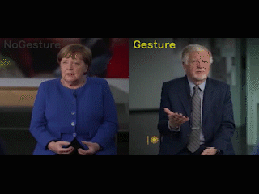

# EnvisionHGDetector: Co-speech Hand Gesture Detection Python Package
A Python package for detecting and classifying hand gestures using MediaPipe Holistic and deep learning.
<div align="center">Wim Pouw (w.pouw@tilburguniversity.edu), Sharjeel Shaikh (sharjeel.shaikh@guest.hpi.de), Bosco Yung, James Trujillo, Gerard de Melo, Babajide Owoyele (babajide.owoyele@hpi.de)</div>

<div align="center">

</div>

## Info
Please go to [UsingEnvisionHGDetector](https://envisionbox.org/embedded_UsingEnvisionHGdetector_package.html) for notebook tutorial on how to use this package. This package provides a straightforward way to detect hand gestures in a variety of videos using a combination of MediaPipe Holistic features and a pre-trained convolutional neural network (CNN)/ LightGBM classifier. If your looking to just quickly generate isolate some gestures into elan, this is the package for you. Do note that annotation by human annotators will still be superior as compared to this gesture coder.

The package performs:

* Feature extraction using MediaPipe Holistic (hand, body, and face features)
* Post-hoc gesture detection using a pre-trained CNN model or LIGHTGBM model, that we trained on SAGA, SAGA++, ECOLANG, TEDM3D, MULTISIMO, GESRES dataset, and the ZHUBO, open gesture annotated datasets.
* Real-time Webcam Detection: Live gesture detection with configurable parameters
* Automatic annotation of videos with gesture classifications
* Output generation in CSV format and ELAN files, and video labeled
* Kinematic analysis: DTW distance matrices and gesture similarity visualization
* Interactive dashboard: Explore gesture spaces and kinematic features

Currently, the detector can identify:
- Just a general hand gesture, ("Gesture" vs. "NoGesture")
- Movement patterns ("Move"; this is only trained on SAGA, SAGA++, and Multisimo, because these are annotated movements that cannot be classified as gestures, ex: nose scratching); it will therefore be a more unreliable category.

## Installation
Consider creating a conda environment first.
```bash
conda create -n envision python==3.10
conda activate envision
(envision) pip install envisionhgdetector
```
otherwise install like this (Note: Ensure python = 3.10)
```bash
pip install envisionhgdetector
```

Note: This package is CPU-only for wider compatibility and ease of use.

## Quick Start

### Batch Video Processing
```python
from envisionhgdetector import GestureDetector

# Initialize detector with model selection
detector = GestureDetector(
    model_type="combined",       # "cnn" or "lightgbm" or "combined"
    cnn_motion_threshold=0.5,    # Motion gate sensitivity
    cnn_gesture_threshold=0.5,   # CNN gesture confidence
    lgbm_threshold=0.5,          # LightGBM gesture probability
    min_gap_s=0.1,               # Merge gaps smaller than this
    min_length_s=0.1             # Minimum gesture duration
)

# Process multiple videos
detector.process_folder(
    input_folder="path/to/videos",
    output_folder="path/to/output"
)
```

### Real-time Webcam Detection
```python
from envisionhgdetector import RealtimeGestureDetector

# Initialize real-time detector
detector = RealtimeGestureDetector(
    confidence_threshold=0.2,   # Applied during detection
    min_gap_s=0.3,             # Applied post-hoc
    min_length_s=0.5           # Applied post-hoc
)

# Process webcam feed
raw_results, segments = detector.process_webcam(
    duration=None,              # Unlimited (press 'q' to quit)
    save_video=True,           # Save annotated video
    apply_post_processing=True  # Apply segment refinement
)

# Analyze previous sessions
detector.load_and_analyze_session("output_realtime/session_20240621_143022/")
```

### Advanced Processing
```python
from envisionhgdetector import utils
import os

# Step 1: Cut videos by detected segments
segments = utils.cut_video_by_segments(output_folder)

# Step 2: Set up analysis folders
gesture_segments_folder = os.path.join(output_folder, "gesture_segments")
retracked_folder = os.path.join(output_folder, "retracked")
analysis_folder = os.path.join(output_folder, "analysis")

# Step 3: Retrack gestures with world landmarks
tracking_results = detector.retrack_gestures(
    input_folder=gesture_segments_folder,
    output_folder=retracked_folder
)

# Step 4: Compute DTW distances and kinematic features
analysis_results = detector.analyze_dtw_kinematics(
    landmarks_folder=tracking_results["landmarks_folder"],
    output_folder=analysis_folder
)

# Step 5: Create interactive dashboard
detector.prepare_gesture_dashboard(
    data_folder=analysis_folder
)
# Then run: python app.py (in output folder)
```

## Features 

### CNN (41, 61, 92)

We engineer 29 features using pose data from MediaPipe Holistic, including:
- Head rotations
- Hand positions and movements
- Body landmark distances
- Normalized feature metrics

Then we create 3 feature sets:
- Basic: 41 -> 29 + 6 visiblity + 6 movement-distinguishing features
- Extended: 61 -> 41 + 20 hand shape features
- World: 92 -> World Landmarks data from Mediapipe: [x,y,z visibility]

### LightGBM (100 features):
- Key joint positions (shoulders, elbows, wrists)
- Velocities
- Movement ranges and patterns
- Index, Thumb, and Middle Finger Distances and Positions
- Visibility Scores
- Symmetry Features
- Smoothness... and more

## Output

The detector generates comprehensive output in organized folder structures depending on the processing mode:

### Batch Video Processing Output

When processing videos with `GestureDetector.process_folder()`, the following files are generated for each video:

1. **Prediction Data**
   - `video_name_predictions.csv` - Frame-by-frame predictions with confidence scores
   - `video_name_segments.csv` - Refined gesture segments after post-processing
   - `video_name_features.npy` - Extracted feature arrays for further analysis

2. **Annotation Files**
   - `video_name.eaf` - ELAN annotation file with time-aligned segments
   - Useful for manual verification, research, and integration with ELAN software

3. **Visual Output**
   - `labeled_video_name.mp4` - Processed video with gesture annotations and confidence graphs
   - Shows real-time detection results with temporal confidence visualization

### Advanced Analysis Pipeline Output

When using the complete analysis pipeline, additional structured outputs are created:

4. **Gesture Segments** (`/gesture_segments/`)
   - Individual video clips for each detected gesture
   - Organized by source video with timing information
   - Format: `video_segment_N_Gesture_start_end.mp4`

5. **Retracked Data** (`/retracked/`)
   - `tracked_videos/` - Videos with MediaPipe world landmark visualization
   - `*_world_landmarks.npy` - 3D world coordinate arrays for each gesture
   - `*_visibility.npy` - Landmark visibility scores

6. **Kinematic Analysis** (`/analysis/`)
   - `dtw_distances.csv` - Dynamic Time Warping distance matrix between all gestures
   - `kinematic_features.csv` - Comprehensive kinematic metrics per gesture
     - Number of submovements, peak speeds, accelerations
     - Spatial features (McNeillian space usage, volume, height)
     - Temporal features (duration, holds, gesture rate)
   - `gesture_visualization.csv` - UMAP projection of DTW distances for dashboard

7. **Interactive Dashboard** (`/app.py`)
   - Web application for exploring gesture similarity space
   - Click gestures to view videos and kinematic features
   - Visualizes gesture relationships and feature distributions

### Real-time Webcam Processing Output

When using `RealtimeGestureDetector.process_webcam()`, outputs are organized in timestamped session folders:

**Session Structure** (`/output_realtime/session_YYYYMMDD_HHMMSS/`):

1. **Raw Detection Data**
   - `raw_frame_results.csv` - Frame-by-frame detection results during recording
   - Contains gesture names, confidence scores, and timestamps

2. **Processed Segments**
   - `gesture_segments.csv` - Refined segments after applying gap and length filters
   - `gesture_segments.eaf` - ELAN annotation file for the session

3. **Session Recording**
   - `webcam_session.mp4` - Annotated video of the entire session
   - Shows real-time detection with overlay information

4. **Session Metadata**
   - `session_summary.json` - Complete session parameters and statistics
   - Includes detection settings, processing results, and performance metrics

### File Format Details

**CSV Prediction Files** contain:
- `time` - Timestamp in seconds
- `has_motion` - Motion detection confidence
- `Gesture_confidence` - Gesture classification confidence  
- `Move_confidence` - Movement classification confidence
- `label` - Final classification after thresholding

**Segment Files** contain:
- `start_time`, `end_time` - Segment boundaries in seconds
- `duration` - Segment length
- `label` - Gesture classification
- `labelid` - Unique segment identifier

**Kinematic Features** include:
- Spatial metrics: gesture space usage, volume, height
- Temporal metrics: duration, holds, submovement counts
- Dynamic metrics: peak speeds, accelerations, jerk values
- Shape descriptors: DTW distances, movement patterns

All outputs are designed for integration with research workflows, ELAN annotation software, and further analysis pipelines.

The detector generates three types of output in your specified output folder:

1. Automated Annotations (`/output/automated_annotations/`)
   - CSV files with frame-by-frame predictions
   - Contains confidence values and classifications for each frame
   - Format: `video_name_confidence_timeseries.csv`

2. ELAN Files (`/output/elan_files/`)
   - ELAN-compatible annotation files (.eaf)
   - Contains time-aligned gesture segments
   - Useful for manual verification and research purposes
   - Format: `video_name.eaf`

3. Labeled Videos (`/output/labeled_videos/`)
   - Processed videos with visual annotations
   - Shows real-time gesture detection and confidence scores
   - Useful for quick verification of detection quality
   - Format: `labeled_video_name.mp4`

4. Retracked Videos (`/output/retracked/`)
   - rendered tracked videos and pose world landmarks

5. Kinematic analysis (`output/analyis/`)
   - DTW distance matrix (.csv) between all gesture comparisons
   - Kinematic features (.csv) per gesture (e.g., number of submovements, max speed, max acceleration)
   - Gesture visualization (.csv; UMAP of DTW distance matrix, for input for Dashboard)

6. Dashboard (`/output/app.py`)
   - This app visualizes the gesture similarity space and shows the kinematic features, the user can click on the videos and identify metrics

## Technical Background

The package builds on previous work in gesture detection, particularly focused on using MediaPipe Holistic for comprehensive feature extraction. The CNN model is designed to handle complex temporal patterns in the extracted features.

## Requirements
- Python 3.10
- tensorflow-cpu
- mediapipe
- opencv-python
- numpy
- pandas

## Citation

If you use this package, please cite:

Pouw, W., Yung, B., Shaikh, S., Trujillo, J., Rueda-Toicen, A., de Melo, G., Owoyele, B. (2024). envisionhgdetector: Hand Gesture Detection Using a Convolutional Neural Network (Version 3.02) [Computer software]. https://pypi.org/project/envisionhgdetector/

### Datasets
- Lücking et al. (2010). The Bielefeld Speech and Gesture Alignment Corpus (SaGA). LREC 2010.
- Gu et al. (2025). The ECOLANG Multimodal Corpus. Scientific Data.
- Koutsombogera & Vogel (2017). The MULTISIMO Multimodal Corpus. ICMI.
- Bao et al. (2024). Editable Co-Speech Gesture Synthesis. Electronics.
- Rohrer, P. (2022). TED M3D Labeling System. Dissertation.
- Hensel, et al. (2025). A richly annotated dataset of co-speech hand gestures across diverse speaker contexts. Scientific Data.

### Methods
- Lugaresi et al. (2019). MediaPipe: A Framework for Perception Pipelines. arXiv.
- Trujillo et al. (2019). Markerless Analysis of Kinematic Features. Behavior Research Methods.
- Pouw & Dixon (2020). Gesture Networks with DTW. Discourse Processes.

### Additional Citations

Adapted CNN Training and inference code:
* Pouw, W. (2024). EnvisionBOX modules for social signal processing (Version 1.0.0) [Computer software]. https://github.com/WimPouw/envisionBOX_modulesWP

Original Noddingpigeon Training code:
* Yung, B. (2022). Nodding Pigeon (Version 0.6.0) [Computer software]. https://github.com/bhky/nodding-pigeon

Some code we reused for creating ELAN files came from Cravotta et al., 2022:
* Ienaga, N., Cravotta, A., Terayama, K., Scotney, B. W., Saito, H., & Busa, M. G. (2022). Semi-automation of gesture annotation by machine learning and human collaboration. Language Resources and Evaluation, 56(3), 673-700.

## Contributing
Feel free to help improve this code. As this is primarily aimed at making automatic gesture detection easily accessible for research purposes, contributions focusing on usability and reliability are especially welcome (happy to collaborate, just reach out to wim.pouw@donders.ru.nl).

