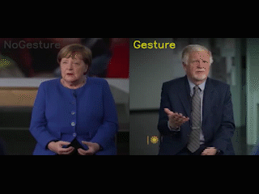

# EnvisionHGDetector: Co-speech Hand Gesture Detection Python Package
A Python package for detecting and classifying hand gestures using MediaPipe Holistic and deep learning.

Wim Pouw (w.pouw@tilburguniversity.edu), Sharjeel Ahmed Shaikh (shaikh1@uni-potsdam.de), Bosco Yung, James Trujillo, Gerard de Melo, Babajide Owoyele (babajide.owoyele@hpi.de)

## Info
Please go to [UsingEnvisionHGDetector](https://envisionbox.org/embedded_UsingEnvisionHGdetector_package.html) for notebook tutorial on how to use this package. This package provides a straightforward way to detect hand gestures in a variety of videos using a combination of MediaPipe Holistic features and a pre-trained convolutional neural network (CNN)/ LightGBM classifier. If your looking to just quickly generate isolate some gestures into elan, this is the package for you. Do note that annotation by human annotators will still be superior as compared to this gesture coder.

The package performs:

* Feature extraction using MediaPipe Holistic (hand, body, and face features)
* Post-hoc gesture detection using a pre-trained CNN model or LIGHTGBM model, that we trained on SAGA, SAGA++, ECOLANG, TEDM3D, MULTISIMO, GESRES dataset, and the ZHUBO, open gesture annotated datasets.
* Real-time Webcam Detection: Live gesture detection with configurable parameters
* Automatic annotation of videos with gesture classifications
* Output generation in CSV format and ELAN files, and video labeled
* Kinematic analysis: DTW distance matrices and gesture similarity visualization
* Interactive dashboard: Explore gesture spaces and kinematic features

Currently, the detector can identify:
- Just a general hand gesture, ("Gesture" vs. "NoGesture")
- Movement patterns ("Move"; this is only trained on SAGA, SAGA++, and Multisimo, because these are annotated movements that cannot be classified as gestures, ex: nose scratching); it will therefore be a more unreliable category.

## Usage

For installation, CLI commands, and Python examples, see the [package usage guide](envisionhgdetector/README.md).

## Features 

### CNN (41, 61, 92)

We engineer 29 features using pose data from MediaPipe Holistic, including:
- Head rotations
- Hand positions and movements
- Body landmark distances
- Normalized feature metrics

Then we create 3 feature sets:
- Basic: 41 -> 29 + 6 visiblity + 6 movement-distinguishing features
- Extended: 61 -> 41 + 20 hand shape features
- World: 92 -> World Landmarks data from Mediapipe: [x,y,z visibility]

### LightGBM (100 features):
- Key joint positions (shoulders, elbows, wrists)
- Velocities
- Movement ranges and patterns
- Index, Thumb, and Middle Finger Distances and Positions
- Visibility Scores
- Symmetry Features
- Smoothness... and more

## Technical Background

The package builds on previous work in gesture detection, particularly focused on using MediaPipe Holistic for comprehensive feature extraction. The CNN model is designed to handle complex temporal patterns in the extracted features.

## Citation

If you use this package, please cite:

Pouw, W., Shaikh, S., Trujillo, J., Yung, B.,   Rueda-Toicen, A., de Melo, G., Owoyele, B. (2026). EnvisionHGDetector: Co-speech Hand Gesture Detection Python Package (Version 3.04) [Computer software]. https://pypi.org/project/envisionhgdetector/

### Datasets
- Lücking et al. (2010). The Bielefeld Speech and Gesture Alignment Corpus (SaGA). LREC 2010.
- Gu et al. (2025). The ECOLANG Multimodal Corpus. Scientific Data.
- Koutsombogera & Vogel (2017). The MULTISIMO Multimodal Corpus. ICMI.
- Bao et al. (2024). Editable Co-Speech Gesture Synthesis. Electronics.
- Rohrer, P. (2022). TED M3D Labeling System. Dissertation.
- Hensel, et al. (2025). A richly annotated dataset of co-speech hand gestures across diverse speaker contexts. Scientific Data.

### Methods
- Lugaresi et al. (2019). MediaPipe: A Framework for Perception Pipelines. arXiv.
- Trujillo et al. (2019). Markerless Analysis of Kinematic Features. Behavior Research Methods.
- Pouw & Dixon (2020). Gesture Networks with DTW. Discourse Processes.

### Additional Citations

Adapted CNN Training and inference code:
* Pouw, W. (2024). EnvisionBOX modules for social signal processing (Version 1.0.0) [Computer software]. https://github.com/WimPouw/envisionBOX_modulesWP

Original Noddingpigeon Training code:
* Yung, B. (2022). Nodding Pigeon (Version 0.6.0) [Computer software]. https://github.com/bhky/nodding-pigeon

Some code we reused for creating ELAN files came from Cravotta et al., 2022:
* Ienaga, N., Cravotta, A., Terayama, K., Scotney, B. W., Saito, H., & Busa, M. G. (2022). Semi-automation of gesture annotation by machine learning and human collaboration. Language Resources and Evaluation, 56(3), 673-700.

## Contributing
Feel free to help improve this code. As this is primarily aimed at making automatic gesture detection easily accessible for research purposes, contributions focusing on usability and reliability are especially welcome (happy to collaborate, just reach out to w.pouw@tilburguniversity.edu).
